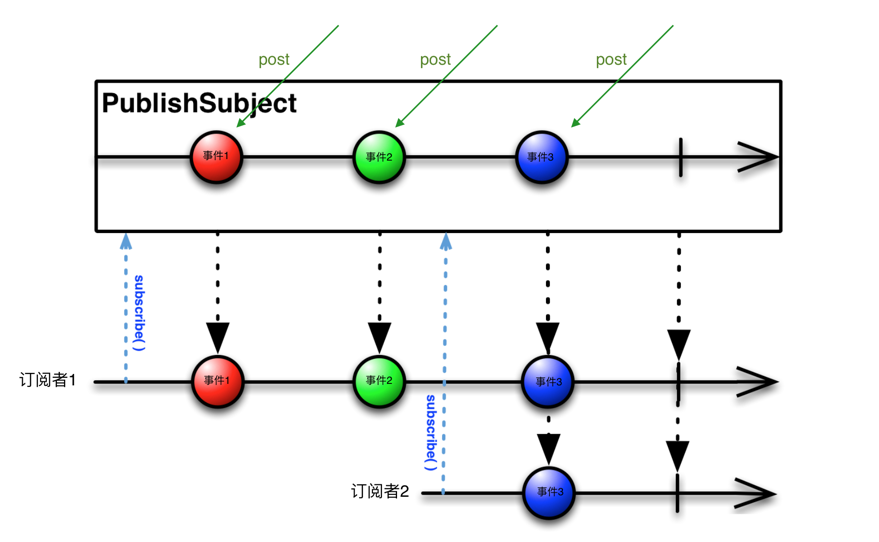

### RxBus

参考：http://www.jianshu.com/p/ca090f6e2fe2

RxBus工作流程图：


### 实现思路

1. 首先创建一个可同时充当Observer和Observable的Subject；
2. 在需要接收事件的地方，订阅该Subject（此时Subject是作为Observable），在这之后，一旦Subject接收到事件，立即发射给该订阅者；
3. 在我们需要发送事件的地方，将事件post至Subject，此时Subject作为Observer接收到事件（onNext），然后会发射给所有订阅该Subject的订阅者。

### 代码示例

这是需要发送实体Event

```
public class UserEvent {
    long id;
    String name;
    public User Event(long id,String name) {
        this.id= id;
        this.name= name;
    }
    public long getId() {
        return id;
    }
    public String getName() {
        return name;
    }
}
```

发送事件:

```
RxBus.get().post(new UserEvent (1, "yoyo"));
```

接收事件:

```
Subscription rxSubscription = RxBus.get().toObserverable(UserEvent.class)
        .subscribe(new Action1<UserEvent>() {
               @Override
               public void call(UserEvent userEvent) {
                   long id = userEvent.getId();
                   String name = userEvent.getName();
                   ...
               }
           },
        new Action1<Throwable>() {
            @Override
            public void call(Throwable throwable) {
                // TODO: 处理异常
            }        
        });
```

最后注意：在生命周期结束的地方取消订阅事件，代码如下：

```
@Override
protected void onDestroy() {
    super.onDestroy();
    if(!rxSubscription.isUnsubscribed()) {
        rxSubscription.unsubscribe();
    }
}
```

### RxBus的优势

- 轻量（一个类，几个方法）
- 对Rx的支持
